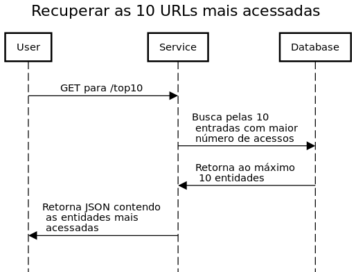

# ShortURL
Um encurtador de URL simples.

## Instruções

### Construindo o artefato

Antes de progredir certifique-se que a versão da **JDK** utilizada é a **12**, que é a versão usada pela imagem base do container que iremos utilizar. No diretório principal do projeto há um script que pode ser usado para construir e executar a aplicação. Para construir a imagem do projeto a partir do Dockerfile execute ```./run.sh build```, como o projeto é construído usando **Maven** podemos pular o plugin que executa os testes durante o processo de build, para tal execute ```./run.sh build skip-test```. 
Após ter construído a imagem o container da aplicação pode ser iniciado executando ```./run.sh```. Caso seja feita alguma modificação no projeto a imagem precisará ser gerada novamente, antes disso a imagem antiga deve ser eliminada executando ```./run.sh clean```. Note que o container da aplicação deve ser parado antes de executar este comando.

### Chamando a API

O encurtador é separado em duas partes, encurtar e recuperar URLs já encurtadas. Para encurtar uma URL é preciso fazer um **POST** para o endpoint /create, no corpo da requisição deve constar a URL desejada e opcionalmente um alias. 
Ex: 
```
POST localhost:8080/create

{"url":"http://google.com", "alias":"abc"}
```
Caso um alias não seja escolhido este será definido e retornado pelo encurtador.
Uma forma de executar as requisições é usando **curl**:
`` curl-H "Content-Type: application/json" -d @body.json localhost:8080/create
`` 

Para recuperar uma URL que já foi encurtada o alias deve ser passado em um GET para
```localhost:8080/u/1edfe3```, onde ```1edfe3``` é o suposto alias gerado anteriormente pelo encurtador. 

```
GET localhost:8080/u/1edfe3
```

Assim a aplicação irá recuperar a URL original e redirecionar o usuário para ela.


As URLs mais requisitadas podem ser consultados fazendo um **GET** para ```/top10```, o contador de requisições só é incrementado por pedidos de encurtamento.

```
GET localhost:8080/top10
```

## Erros

Existem três tipos diferentes de erros que API pode retornar em JSON, os três primeiros são referentes ao processo de encurtação e o último ocorre na recuperação da URL encurtada:

```
{
    "ERROR_CODE" : "000",
    "DESCRIPTION" : "No input was specified, please inform the URL you wish to shorten."
}
```
```
{
    "ERROR_CODE" : "001",
    "DESCRIPTION" : "Custom alias already in use for a different URL, please use a different one."
}
```
```
{
    "ERROR_CODE" : "002",
    "DESCRIPTION" : "This URL has been mapped already."
}
```
```
{
    "ERROR_CODE" : "003",
    "DESCRIPTION" : "No URL found for the given identifier."
}
```

## Acessando o banco de dados

Enquanto a aplicação estiver em execução é possível acessar o console do **H2** que é o banco de dados usado, para acessar vá para ```localhost:8080/h2-console``` e siga o exemplo abaixo:


## Diagramas de sequência




# Hire.me
Um pequeno projeto para testar suas habilidades como programador.

## Instruções Gerais

1. *Clone* este repositório
2. Em seu *fork*, atenda os casos de usos especificados e se desejar também os bonus points
3. Envio um e-mail para rh@bemobi.com.br com a seu Nome e endereço do repositorio.

## Projeto

O projeto consiste em reproduzir um encurtador de URL's (apenas sua API), simples e com poucas funções, porém com espaço suficiente para mostrar toda a gama de desenho de soluções, escolha de componentes, mapeamento ORM, uso de bibliotecas de terceiros, uso de GIT e criatividade.

O projeto consiste de dois casos de uso: 

1. Shorten URL
2. Retrieve URL

### 1 - Shorten URL


1. Usuario chama a API passando a URL que deseja encurtar e um parametro opcional **CUSTOM_ALIAS**
    1. Caso o **CUSTOM_ALIAS** já exista, um erro especifico ```{ERR_CODE: 001, Description:CUSTOM ALIAS ALREADY EXISTS}``` deve ser retornado.
    2. Toda URL criada sem um **CUSTOM_ALIAS** deve ser reduzida a um novo alias, **você deve sugerir um algoritmo para isto e o porquê.**
    
2. O Registro é colocado em um repositório (*Data Store*)
3. É retornado para o cliente um resultado que contenha a URL encurtada e outros detalhes como
    1. Quanto tempo a operação levou
    2. URL Original

Exemplos (Você não precisa seguir este formato):

* Chamada sem CUSTOM_ALIAS
```
PUT http://shortener/create?url=http://www.bemobi.com.br

{
   "alias": "XYhakR",
   "url": "http://shortener/u/XYhakR",
   "statistics": {
       "time_taken": "10ms",
   }
}
```

* Chamada com CUSTOM_ALIAS
```
PUT http://shortener/create?url=http://www.bemobi.com.br&CUSTOM_ALIAS=bemobi

{
   "alias": "bemobi",
   "url": "http://shortener/u/bemobi",
   "statistics": {
       "time_taken": "12ms",
   }
}
```

* Chamada com CUSTOM_ALIAS que já existe
```
PUT http://shortener/create?url=http://www.github.com&CUSTOM_ALIAS=bemobi

{
   "alias": "bemobi",
   "err_code": "001",
   "description": "CUSTOM ALIAS ALREADY EXISTS"
}
```

### 2 - Retrieve URL


1. Usuario chama a API passando a URL que deseja acessar
    1. Caso a **URL** não exista, um erro especifico ```{ERR_CODE: 002, Description:SHORTENED URL NOT FOUND}``` deve ser retornado.
2. O Registro é lido de um repositório (*Data Store*)
3. Esta tupla ou registro é mapeado para uma entidade de seu projeto
3. É retornado para o cliente um resultado que contenha a URL final, a qual ele deve ser redirecionado automaticamente

## Stack Tecnológico

Não há requerimentos específicos para linguagens, somos poliglotas. Utilize a linguagem que você se sente mais confortável.

## Bonus Points

1. Crie *testcases* para todas as funcionalidades criadas
2. Crie um *endpoint* que mostre as dez *URL's* mais acessadas 
3. Crie um *client* para chamar sua API
4. Faça um diagrama de sequencia da implementação feita nos casos de uso (Dica, use o https://www.websequencediagrams.com/)
5. Monte um deploy da sua solução utilizando containers 
